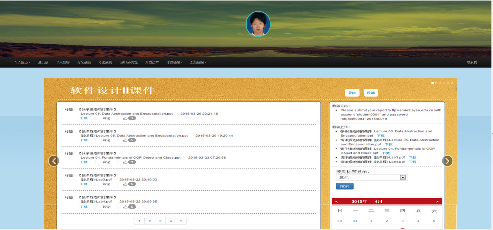

# 个人主页项目源码
网址为：http://yudesong.sinaapp.com/
#采用技术
<ul>
  <li>WEB前端技术HTML+CSS+JavaScript</li>
  <li>WEB前端框架Bootstra和EasyUI</li>
  <li>XML/JSON数据传输以及存储</li>
  <li>异刷新模式Ajax数据</li>
  <li>服务器端程序采用PHP+MySQL数据库搭建</li>
</ul>
#项目内容
个人简历&nbsp;&nbsp;通讯录管理系统&nbsp;&nbsp;&nbsp;个人博客系统&nbsp;&nbsp;
考试系统&nbsp;&nbsp;&nbsp;开发技术&nbsp;&nbsp;&nbsp;项目链接
#效果图

